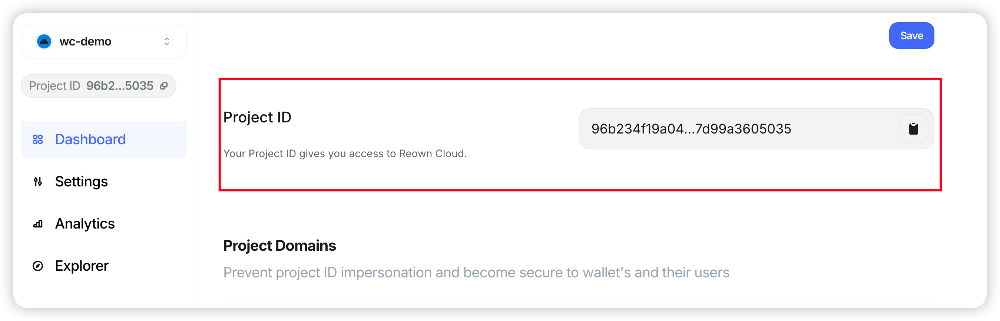

# Cloud 配置

在 https://cloud.reown.com/ 注册并登录账号，可以用邮箱或者钱包

登录之后，创建新项目并获取到 projectId

## verify domain

成功获取到 projectId 之后，需要验证域名，才可以正常连接钱包

验证步骤请参考：https://docs.reown.com/cloud/verify

验证成功后，如图所示：

# 链接钱包

## 创建配置

参见 src/config/index.ts

## 创建 Provider

参见 src/context/index.tsx

## 链接并发送交易

参见 src/context/index.tsx